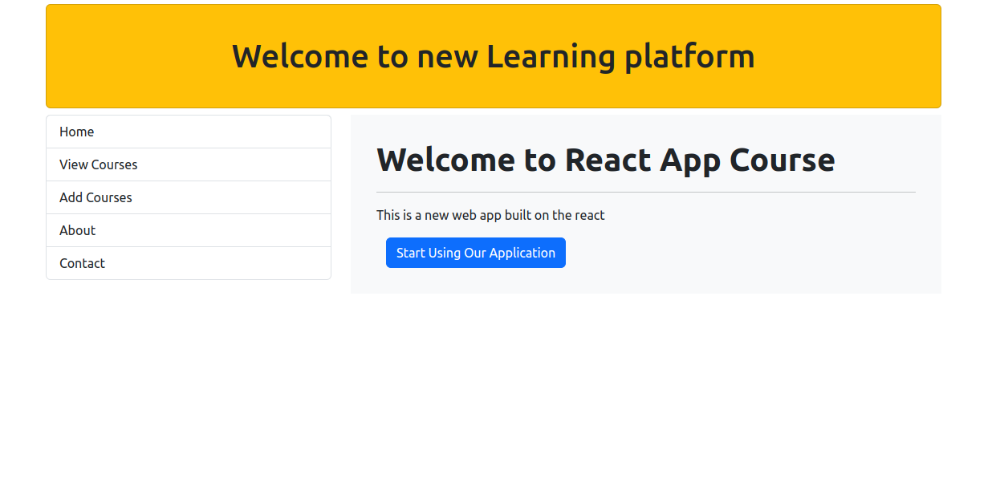
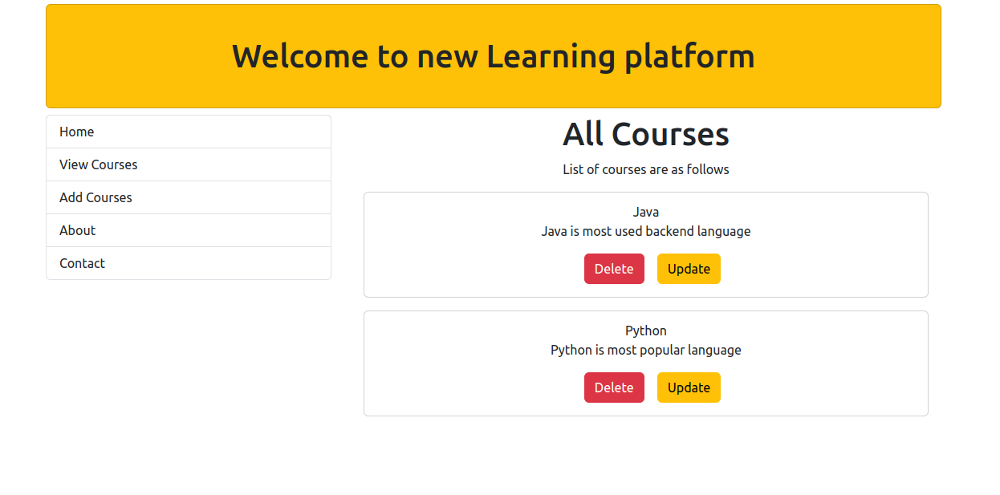
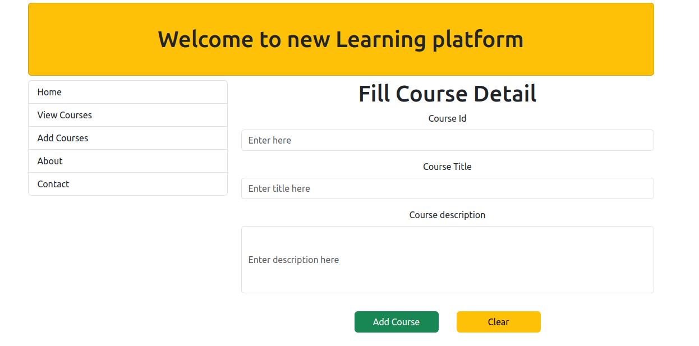
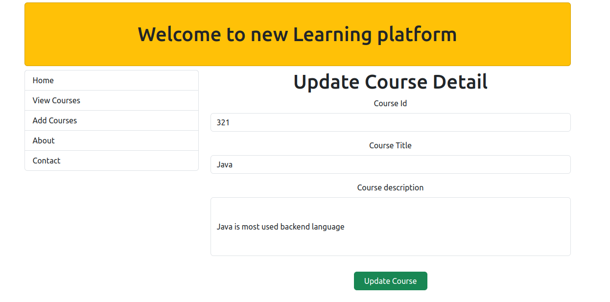

# Simple React JS Project

## What is the use of this Repo

This Project is a Simple ReactJS Project which demonstrates the following
1. Creating a Component in React
2. Making HTTP calls to BE running on different port.
3. Communicating between parent and child component
4. Using Bootstrap along with React
5. Using Basic Routing in React

## Prerequisites

### Download and follow instruction form below repo for BE support
[BE service](https://github.com/vermasuraj11011/Backend_for_react_app)

Complete the above step first ,

### Install Node JS
Refer to [Node.js](https://nodejs.org/en/) to install nodejs

### Install create-react-app
Install create-react-app npm package globally. This will help to easily run the project and also build the source files easily. Use the following command to install create-react-app

```bash
npm install -g create-react-app
```

## Cloning and Running the Application in local

Clone the project into local

Install all the npm packages. Go into the project folder and type the following command to install all npm packages

```bash
npm install
```

In order to run the application Type the following command

```bash
npm start
```

The Application Runs on **localhost:3000**

## Application design

#### Components

1. **Home** Component: It is the landing page of the application.

2. **Header** Component: It is a header component which is visible throughout the application.

3. **Menu** Component: It is like a side navbar which route user to different page. 

4. **AllCourse** Component: It is used to display the list of all component.

5. **Course** Component : This Component displays a single course detail.

6. **AddCourse** Component : This Component is used to add the new course.

7. **UpdateCourse** Component: This Component is used to update the already existing course.

#### Feature
1. User can add the course.
2. User can view the list of all courses.
3. User can update the course detail.
4. User can delete the course from view page.

#### HTTP client

**axios** library is used to make HTTP Calls to BE running on 8080

#### URL

base url <br>
http://localhost:3000

| View               | Url                       |
|--------------------|---------------------------|
| Home Page          | /                         |
| View All Course    | /view-course              |
| Add Course         | /add-course               |
| Update Course      | /update-course/{courseId} |


## Views

**Home Page**



**View All Course page**
 

 **Add Course page**
 

 **Update Course page**
 


## Resources

**create-react-app** : The following link has all the commands that can be used with create-react-app
[Create React App](https://github.com/facebook/create-react-app)

**ReactJS** : Refer to [doc](https://reactjs.org/) to understand the concepts of ReactJS

**React Bootstrap** : Refer to [ReactStrap Doc](https://react-bootstrap.github.io/getting-started/introduction/) to understand how to use React Bootstrap